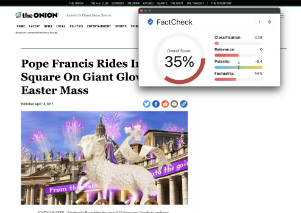
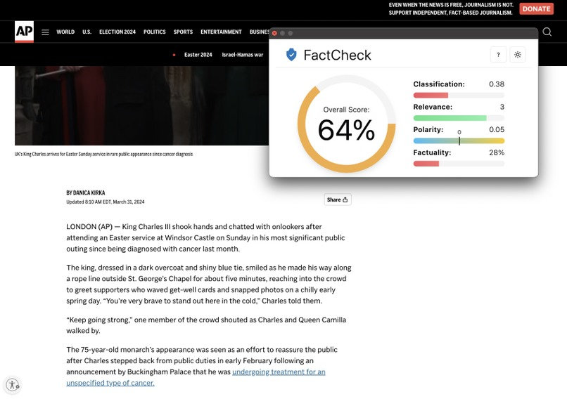

# FactCheck
## <a href="https://devpost.com/software/factcheck-qzxet2">Devpost</a>

# **What it does**

FactCheck is a powerful Chrome extension designed to empower users with accurate and credible information while browsing the web. Leveraging the latest advancements in Natural Language Processing (NLP), Machine Learning (ML), and Neural Networks, FactCheck provides a comprehensive assessment of the credibility of information on the web pages you visit.

# **Key Features**

Credibility Measurement: Utilizing cutting-edge NLP algorithms, FactCheck evaluates the content of web pages to determine the credibility of the information presented.

Resource Compilation: FactCheck aggregates relevant resources and authoritative sources related to the content being viewed, enabling users to access additional information and verify facts independently.

Real-Time Scoring: With ML models, FactCheck generates real-time credibility scores for web pages, helping users make informed decisions about the reliability of the information they encounter.

User-Friendly Interface: The extension seamlessly integrates into your browser, providing intuitive tools and visual indicators to highlight credible sources and potential misinformation.

Educational Insights: FactCheck not only evaluates credibility but also educates users on common indicators of misinformation, fostering digital literacy and critical thinking.

# **How we built it**
FactCheck was built using a combination of cutting-edge technologies and methodologies. We leveraged Natural Language Processing (NLP) techniques to analyze the content of web pages, extract key features, and assess the credibility of information. Machine Learning (ML) algorithms, particularly Multinomial Naive Bayes and Neural Networks, were employed to train models that could classify text into different sentiment categories such as 'positive,' 'negative,' and 'neutral.' These models were integrated into a user-friendly Chrome extension using Python and relevant libraries such as NLTK, TextBlob, Pandas, Scikit-Learn, and Keras.

# Challenges we ran into
While developing FactCheck, we encountered several challenges that tested our skills and problem-solving abilities. One major challenge was fine-tuning the ML models to accurately classify sentiments across various types of content and languages. Ensuring the extension's compatibility with different browsers and optimizing performance for real-time scoring were also areas that required meticulous attention and testing. Additionally, sourcing and curating credible data sets and resources posed a challenge due to the vastness and dynamic nature of online information.

# Accomplishments that we're proud of
Despite the challenges, FactCheck achieved several significant accomplishments that we're proud of. Firstly, we successfully developed a robust and scalable Chrome extension that seamlessly integrates into users' browsing experiences, providing valuable insights and resources for evaluating credibility. Our ML models achieved high accuracy rates in sentiment analysis and credibility scoring, showcasing the effectiveness of our approach in assessing information reliability. Moreover, FactCheck garnered positive feedback from early users and received recognition in the tech community for its innovative solution to combating misinformation.

# What we learned
The development of FactCheck was a tremendous learning experience for our team. We gained a deeper understanding of NLP techniques, ML model training, and web development practices. We learned the importance of data preprocessing, feature engineering, and model evaluation in building effective sentiment analysis and credibility assessment systems. Furthermore, the project reinforced the significance of digital literacy, critical thinking, and ethical considerations in addressing the challenges of misinformation and fake news in today's digital age

# Why FactCheck?

In today's digital age, misinformation and fake news are prevalent. FactCheck empowers users to navigate this landscape by equipping them with the tools and knowledge needed to distinguish fact from fiction. Whether you're researching news articles, academic papers, or general information, FactCheck is your reliable companion for ensuring accuracy and credibility online.

Install FactCheck today and embark on a journey towards informed decision-making and digital empowerment!
